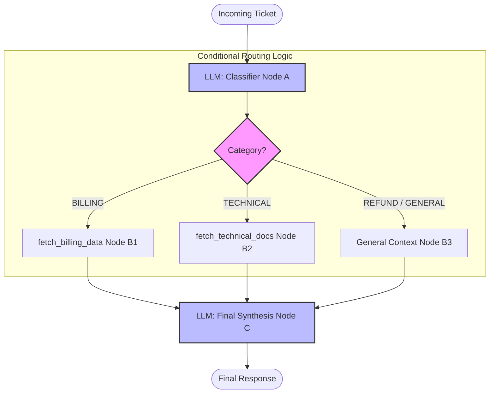
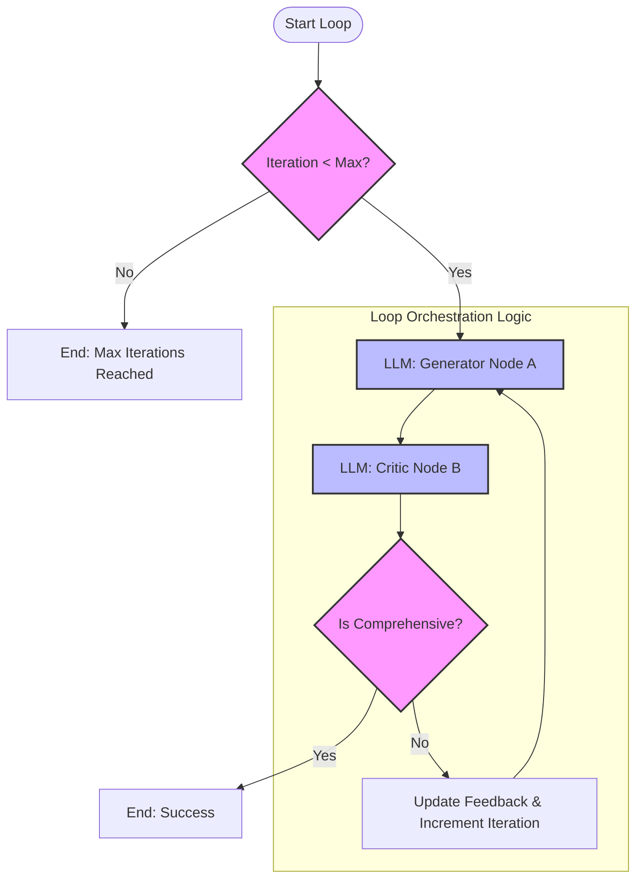

# Orchestration & Routing

This module explores different patterns for orchestrating LLM calls and routing logic.

## Conditional Routing

This pattern uses an initial LLM call to classify an incoming request and then routes it to specific tools or logic based on that classification.

### File: [3_conditional_routing.py](file:///c:/Users/Abhineet%20Anand/Desktop/Projects/AI%20Engineering%20Roadmap/1_AI%20Application%20Development/1_Orchestration/3_conditional_routing.py)

**Question:** How does the system handle different types of customer support tickets (Billing vs. Technical)?

The following graph illustrates the conditional routing flow implemented in this file:

## Loop Orchestration (Optimizer Pattern)

This pattern involves an iterative loop where one LLM generates content and another LLM (the Critic) evaluates it against a rubric, providing feedback for refinement.

### File: [4_loop_orchestration.py](file:///c:/Users/Abhineet%20Anand/Desktop/Projects/AI%20Engineering%20Roadmap/1_AI%20Application%20Development/1_Orchestration/4_loop_orchestration.py)

**Question:** How do we ensure the output meets high technical standards through iterative refinement?

The following graph illustrates the loop orchestration flow implemented in this file:

